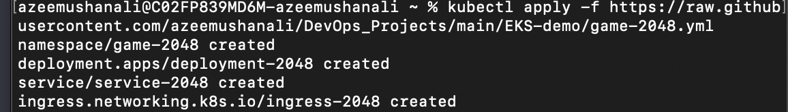

```
eksctl  create cluster --name azeem-demo --region us-west-2 --fargate
```



To update kubectl command or update kube-config file - 
```
aws eks update kube-config --name azeem-demo --region us-west-2
```


To delete the cluster after deployment
```
eksctl delete cluster --region=us-west-2 --name=azeem-demo
```