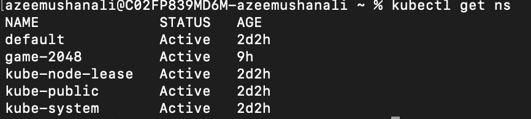
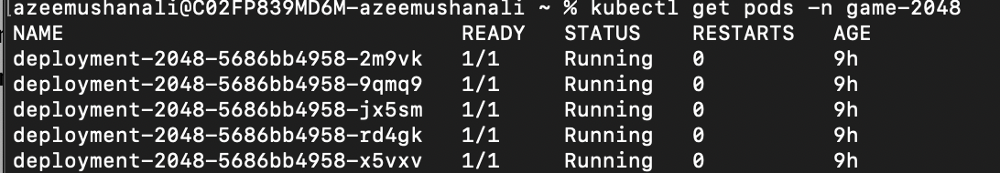
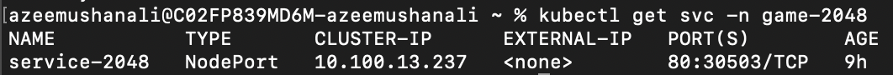
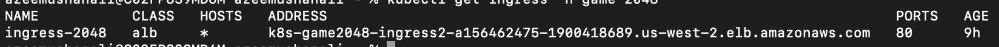
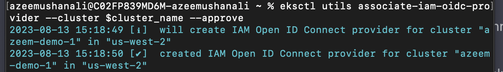

Create A Fargate profile - 

```
eksctl  create fargateprofile --cluster azeem-demo-1 --region us-west-2 --name sample-app --namespace game-2048
```

```
kubectl apply -f https://raw.githubusercontent.com/azeemushanali/DevOps_Projects/main/EKS-demo/game-2048.yml
```

```
kubectl get ns 
```


```
kubectl get pods -n game-2048 
```

use -w to watch it getting created

```
kubectl get svc -n game-2048
```

```
kubectl get ingress -n game-2048
```


# Commands to Configure IAM OIDC provider 

```
export cluster_name=azeem-demo-1
eksctl utils associate-iam-oidc-provider --cluster $cluster_name --approve
```
