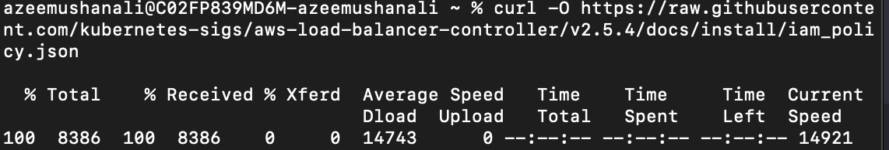
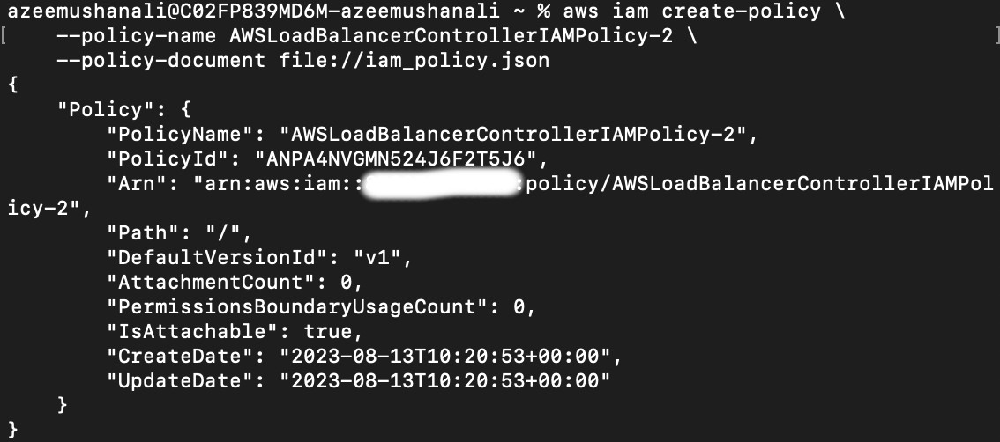
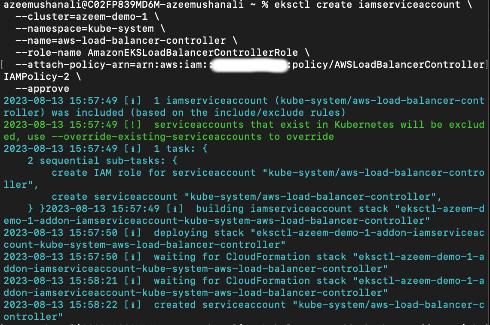
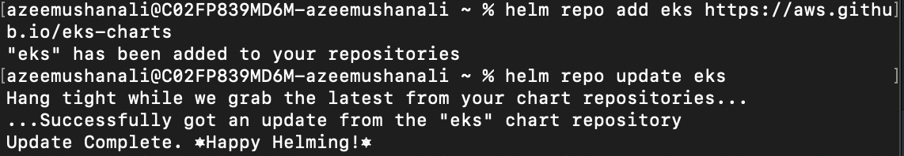
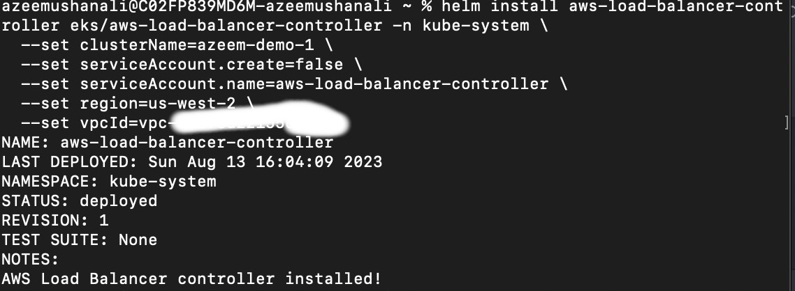
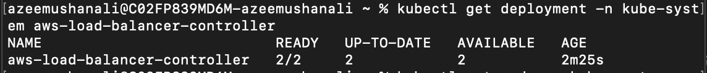
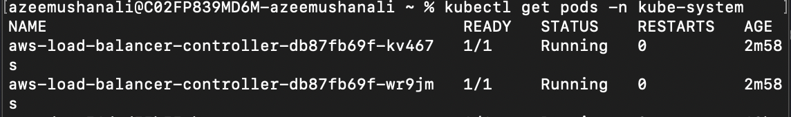
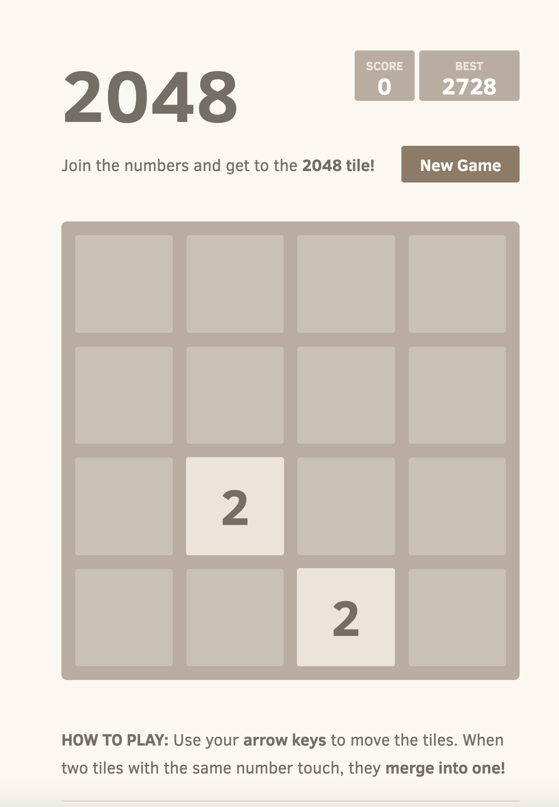

Follow this link - [ALB-Controller Documentaion](https://docs.aws.amazon.com/eks/latest/userguide/aws-load-balancer-controller.html)


```
curl -O https://raw.githubusercontent.com/kubernetes-sigs/aws-load-balancer-controller/v2.5.4/docs/install/iam_policy.json
```


```
aws iam create-policy \
    --policy-name AWSLoadBalancerControllerIAMPolicy \
    --policy-document file://iam_policy.json
```


```
eksctl create iamserviceaccount \
  --cluster=azeem-demo-1 \
  --namespace=kube-system \
  --name=aws-load-balancer-controller \
  --role-name AmazonEKSLoadBalancerControllerRole \
  --attach-policy-arn=arn:aws:iam::11221232233232:policy/AWSLoadBalancerControllerIAMPolicy \
  --approve
```


```
brew install helm
helm repo add eks https://aws.github.io/eks-charts
helm repo update eks
```


```
helm install aws-load-balancer-controller eks/aws-load-balancer-controller -n kube-system \
  --set clusterName=azeem-demo-1 \
  --set serviceAccount.create=false \
  --set serviceAccount.name=aws-load-balancer-controller \
  --set region=us-west-2 \
  --set vpcId=vpc-some-id
```



```
kubectl get deployment -n kube-system aws-load-balancer-controller
```


```
kubectl get pods -n kube-system
```


check for load balancer,if it is available 

Find and hit DNS of ALB to get the game. 


